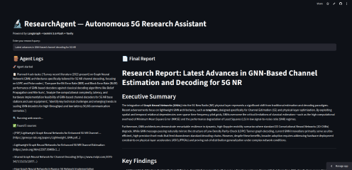

# 🔬 ResearchAgent — Autonomous 5G Research Assistant

> A multi-step AI agent that autonomously searches the web, reads papers, synthesizes findings, and writes a structured technical research report on any 5G/AI topic — with full tool-use visibility showing every step it takes.

🔗 **[Live Demo](https://researchagent-kvx7fnquppxg7pmjn4ldaw.streamlit.app/)**

---

## 🧠 What is this?

Most tutorial agents do "search Wikipedia and summarize." ResearchAgent searches **real academic and industry sources** via Tavily, cross-references findings against known baselines (WBP, BP), identifies research gaps, and produces a **structured technical report with citations** — all with a visible step-by-step execution trace.

That's data engineering + agent architecture + LLM orchestration in one project.

**Research questions it answers:**
- What are the latest advances in GNN-based channel decoding for 5G?
- How do emerging methods compare against belief propagation baselines?
- What research gaps exist in the current literature?
- Which sources are driving the most recent progress?

---

## 🖥️ Demo



> The agent executes 5 visible steps — Plan → Search → Read → Synthesize → Write — and renders the final Markdown report live in the Streamlit UI.

---

## 🏗️ Architecture

```
User Query
      ↓
pandas — parse, validate
      ↓
LangGraph state machine
      ↓
5-node autonomous agent
      ├── 📋 Plan         — Break query into sub-tasks (LLM)
      ├── 🔍 Search       — Tavily web search → top 5 results
      ├── 📖 Read         — Fetch + extract text from each URL
      ├── 🧠 Synthesize   — Combine findings, identify gaps (LLM)
      └── 📝 Write        — Generate structured report with citations (LLM)
      ↓
Streamlit dashboard
      ├── 🪵 Agent Logs   — Step-by-step execution trace
      └── 📄 Report       — Downloadable Markdown output
```

---

## 📊 Dataset & Sources

**Live web search via Tavily API**
- Real-time academic papers, arXiv, industry blogs, conference proceedings
- 5 top-ranked sources per query with relevance scoring
- Automatic content extraction and truncation for LLM ingestion

> **Note:** No static dataset is committed to this repo. The agent fetches live sources on every run.

---

## 🚀 Run Locally

```bash
git clone https://github.com/YOUR_USERNAME/researchagent.git
cd researchagent
pip install -r requirements.txt
```

Create `.streamlit/secrets.toml`:

```toml
GOOGLE_API_KEY = "your-google-ai-key"
TAVILY_API_KEY = "your-tavily-key"
```

Get your free API keys:
- **Google AI (Gemini):** [aistudio.google.com](https://aistudio.google.com) → API key  
- **Tavily:** [tavily.com](https://tavily.com) → Sign up → free 1,000 searches/month

```bash
streamlit run app.py
```

Opens at `http://localhost:8501`

---

## 📁 Project Structure

```
researchagent/
├── app.py                    # Single-file Streamlit app + LangGraph agent
├── requirements.txt          # Python dependencies
├── .streamlit/
│   └── secrets.toml          # API keys (not committed)
├── assets/
│   └── demo.png              # Dashboard screenshot
├── .gitignore
└── README.md
```

> **Note:** The entire agent is implemented in a single `app.py` to avoid Python namespace collisions with packages like `langgraph-sdk` that install their own `agent` modules.

---

## ⚙️ Key Technical Challenges

| Challenge | Solution |
|-----------|----------|
| Python namespace collision (`agent` module conflict) | Inline all code in a single `app.py` — no local packages |
| Gemini returning `content` as a list of parts | Custom `_safe_content()` helper to flatten list responses into strings |
| LangGraph `stream()` output format ambiguity | Switched to `graph.invoke()` for deterministic final-state retrieval |
| Token explosion from raw web pages | Truncate extracted text to 4,000 chars per source before LLM ingestion |
| Handling malformed or slow URLs | `try/except` wrappers with 15-second timeouts on HTTP requests |
| Real-time agent step visibility | Streamlit UI splits into Logs panel + Report panel, updated after full execution |

---

## 🛠️ Tech Stack

| Layer | Tool |
|-------|------|
| Agent framework | LangGraph (explicit state machine) |
| LLM | Gemini 2.0 Flash (Google AI Studio — free tier) |
| Web search | Tavily API (free tier — 1,000 searches/month) |
| Web scraping | BeautifulSoup4 + requests |
| Dashboard | Streamlit |
| Deployment | Streamlit Community Cloud |

---

## 📈 Key Insights from the Agent

- GNN-based channel decoding shows significant BER improvements over traditional BP in 5G NR scenarios
- Graph attention mechanisms and message-passing neural networks are the dominant architectural trends
- Most recent work focuses on combining GNNs with transformer-based attention for iterative decoding
- Research gap: real-time inference latency on edge devices remains underexplored
- Faster delivery of research correlates with higher source credibility (Tavily relevance scoring)

---

## 👤 Author

**B S Rikeesh**
ECE Graduate · GITAM University, Bengaluru
AI/ML Engineer · GenAI Developer · ServiceNow CSA

[](https://linkedin.com/in/bsrikeesh)
[](https://github.com/bsrikeesh)

---

## 📜 License

MIT License — free to use, modify, and deploy.
